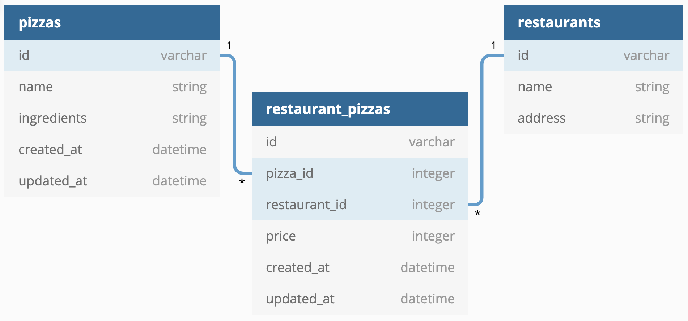

# Pizza Restaurant Tracker API

This is a simple API for tracking pizza restaurants and their menus. The API is built using Ruby on Rails and supports the following functionality:

- Create, read, update, and delete restaurants
- Create, read, update, and delete pizzas
- Associate pizzas with restaurants and set their prices

## Setup
To get started with the API, follow these steps:

1. Clone the repository to your local machine
2. Run `bundle install` to install dependencies
3. Run `rails db:migrate` to run database migrations
4. Run `rails db:seed` to populate the database with sample data
5. Run `rails server` to start the server

The API should now be available at `http://localhost:3000`.

# Endpoints
The following endpoints are available in the API:

## Routes
The API has the following routes:

- ### GET /restaurants

Returns a list of all restaurants.
GET /restaurants/:id

Returns information about the restaurant with the specified id, including a list of pizzas served by the restaurant.

- ### DELETE /restaurants/:id

Deletes the restaurant with the specified id, along with all restaurant-pizza associations.

- ### GET /pizzas

Returns a list of all pizzas.

- ### POST /restaurant_pizzas

Creates a new restaurant-pizza association. The request body should include the price of the pizza at the restaurant, the ID of the pizza, and the ID of the restaurant.

## Models

The API has three models:

<strong>Restaurant</strong>: Represents a pizza restaurant. Has many pizzas through restaurant_pizzas.

<strong>Pizza</strong>: Represents a type of pizza. Has many restaurants through restaurant_pizzas.

<strong>RestaurantPizza</strong>: Represents a specific pizza available at a specific restaurant. Belongs to a restaurant and a pizza.

## Validations

The RestaurantPizza model has a validation that ensures the price is between 1 and 30.

# Usage

To use this API, you can make HTTP requests to the above routes using a tool like Postman or cURL. Responses will be in JSON format.

# Conclusion

This API provides a simple way to track pizzas served by different restaurants, and allows for easy creation and deletion of restaurant-pizza associations. It can be used as the foundation for a more complex pizza-tracking system or adapted for other types of restaurants and food items.